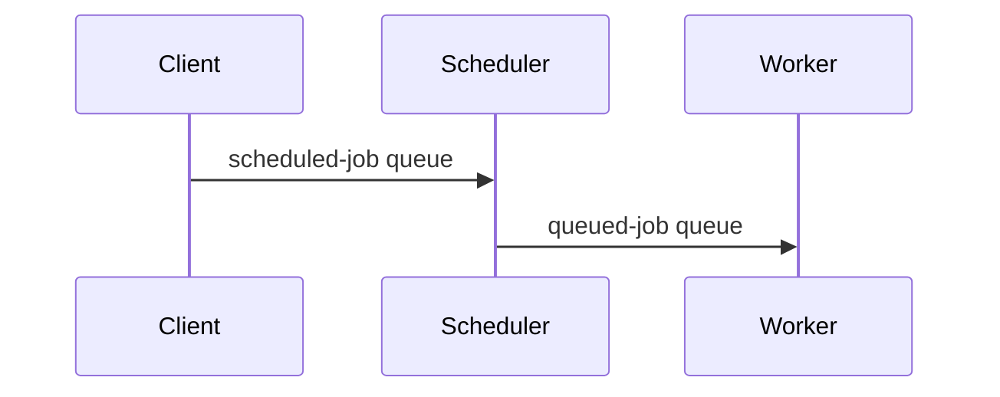

# Scheduler

## Getting Started

- Create a virtual environment:
  ```bash
  python -m venv venv
  ```
  Notes:
  - On Windows: Use `python` or `py -3` if you have the Python Launcher
  - On macOS/Linux: Use `python3` if `python` points to Python 2
  - Alternative Windows command: `py -m venv venv`
- Activate the virtual environment:
  - On Windows:
    ```bash
    venv\Scripts\activate
    ```
  - On macOS and Linux:
    ```bash
    source venv/bin/activate
    ```
- Install dependencies:
  ```bash
  pip install -r requirements.txt
  ```
- Start the project:
  ```bash
  python app/main.py
  ```

## Jobs

Job scheduling is relying on the [rq](https://github.com/rq/rq) and
[rq-scheduler](https://github.com/rq/rq-scheduler) packages.


Jobs are simple Python functions, that could take any number of arguments:

```python
def my_function(arg1, arg2):
    # Your job logic here
    print(f"Job executed with arguments: {arg1}, {arg2}")
```

To trigger a function on the main `backend` app, you can use the `job_request`
function in the `job.py` module. With this function, you can schedule an HTTP
request to the backend app, which can be used to invoke some logic. 
All endpoints triggered by the scheduler should be under the `/jobs` path.
See the `job_router` in the backend app for more details. 

Example of a job request:

```python
from job import job_request

# This will trigger the `/v1/jobs/breaking-news` endpoint in the backend app
# every 10 seconds
service.schedule_periodic(
    id=UUID("cc1dface-9213-4eed-8cb2-0edba6b2159c"),
    every_seconds=10,
    func=job_request,
    args=[f"{cfg.API_BASE_URL}/v1/jobs/breaking-news"],
)
```
## Scheduling Jobs

To schedule jobs, you can use the `SchedulerService` class, which is a wrapper
around the `rq-scheduler` package.

_Note:_ for the scheduler to work, you need to have a Redis server running.

Schedule a periodic job:

```python
from app.services.scheduler import SchedulerService

SchedulerService.schedule_periodic(
    id=UUID("cc1dface-9213-4eed-8cb2-0edba6b2159c"),
    interval=60,  # Runs every 60 seconds
    func=my_function,
    args=(arg1, arg2),
)
```
On periodic jobs, we must provide a unique `id` (uuidv4) to identify
the job. This is needed that the job is not scheduled multiple times
when restarting the service.
Another important note is that the `interval` parameter is in seconds, and
by convention your code should avoid scheduling a job if the interval is
negative. You should also make sure to let the user customize the interval
using environment variables.

Schedule a job to run immediately:

```python
from app.services.scheduler import SchedulerService

SchedulerService.schedule_job(
    func=my_function,
    args=(arg1, arg2),
)
```

Schedule a job to run at a specific time:

```python
from app.services.scheduler import SchedulerService
from datetime import datetime

SchedulerService.schedule_at(
    execution_time=datetime(2023, 10, 1, 12, 0, 0),
    func=my_function,
    args=(arg1, arg2),
)
```
**NOTE**: The `execution_time` is a timezone-aware `datetime` object. 
Please always use UTC for the `execution_time` to avoid issues with timezones.


Async jobs can also be scheduled, but they need to be wrapped in a synchronous
function:

```python
from asyncio import get_event_loop

async def my_async_function(arg1, arg2):
    # Your async job logic here
    print(f"Async job executed with arguments: {arg1}, {arg2}")

def my_job(arg1, arg2):
    loop = get_event_loop()
    loop.create_task(my_async_function(arg1, arg2))

# ...

SchedulerService.schedule_job(
    func=my_job,
    args=(arg1, arg2),
)
```

## How does it work?

The job scheduling process is composed of three main components

- The _client_, which decides which job must be scheduled and when (i.e. the
  FastAPI app);
- The _scheduler_, which is responsible for the actual scheduling of the jobs; and
- The _worker_, which is a mere executor of the scheduled jobs.



The flow is as follows:

1. The client creates a job using the `rq-scheduler` package (see previous section).
   By doing so, the job is added to a Redis queue dedicated to scheduled jobs.
2. The scheduler is a long-running process that checks the Redis queue for
   scheduled jobs. When it finds a job that is due to be executed, it moves the
   job to another Redis queue, containing jobs that are ready to be executed.
3. Finally, the worker consumes the jobs from the execution queue and executes them.

## How to debug?

To debug the job scheduling process, you can use the [rq-dashboard](https://github.com/Parallels/rq-dashboard)
package. You can install it with:

```bash
pip install rq-dashboard
```

Then, you can run the dashboard with:

```bash
rq-dashboard
```

Make sure the dashboard is running on the same Redis server as the scheduler and worker.
