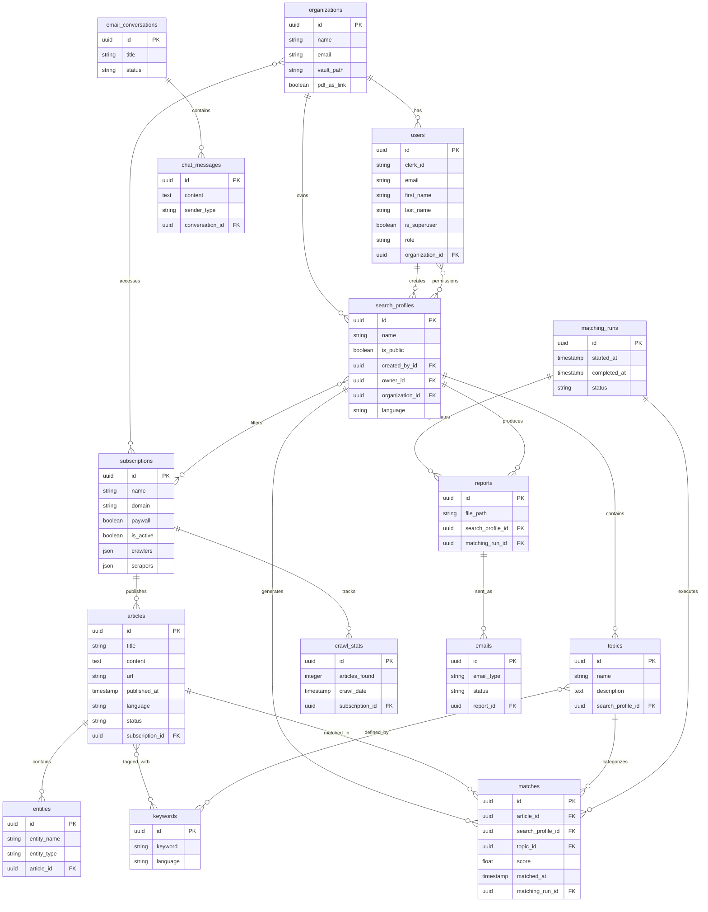

# Database Schema Documentation

## Overview

The MediaMind system uses a PostgreSQL database with 18+ tables supporting news article processing, user management, matching algorithms, and reporting functionality.

## Database Tables & File Locations

### Backend Tables (`apps/backend/app/models/`)

- **articles.py** - News articles with multilingual support
- **users.py** - User management and authentication
- **organizations.py** - Multi-tenant organization structure
- **search_profiles.py** - Content filtering profiles
- **subscriptions.py** - News sources configuration
- **matches.py** - Article-profile matching results
- **topics.py** - Thematic content groupings
- **keywords.py** - Search and matching keywords
- **entities.py** - Named entity extraction results
- **reports.py** - Generated PDF reports
- **emails.py** - Email delivery tracking
- **email_conversations.py** - Chatbot conversation threads
- **chat_messages.py** - Individual chat interactions
- **matching_runs.py** - Algorithm execution tracking
- **crawl_stats.py** - Web crawling performance metrics

### API Tables (`apps/api/app/models/`)

- **associations.py** - Many-to-many relationship tables

## Database Schema Diagram

## Key Relationships

### Core Data Flow

1. **Organizations** contain **Users** and own **Search Profiles**
2. **Subscriptions** publish **Articles** that get crawled and processed
3. **Search Profiles** define filtering criteria and generate **Topics**
4. **Articles** are matched against **Topics** to create **Matches**
5. **Matching Runs** execute algorithms and generate **Reports**
6. **Reports** are distributed via **Emails**

### Content Processing Pipeline

- Articles are crawled from Subscriptions
- Named Entities and Keywords are extracted from Articles
- Matching algorithms connect Articles to Search Profiles via Topics
- Results are compiled into Reports and sent as Emails

### User & Permission Model

- Organizations provide multi-tenant data isolation
- Users have role-based access (admin > maintainer > member)
- Search Profiles support hierarchical permissions (owner > editor > reader)

## Migration Files

- **Backend**: `apps/backend/alembic/versions/`
- **API**: `apps/api/alembic/versions/`
- **Configuration**: `alembic.ini` in respective app directories

## Technical Notes

- All tables use UUID primary keys
- Multilingual support (EN/DE) throughout the system
- JSON fields for flexible configuration storage
- Encrypted credentials for secure data handling
