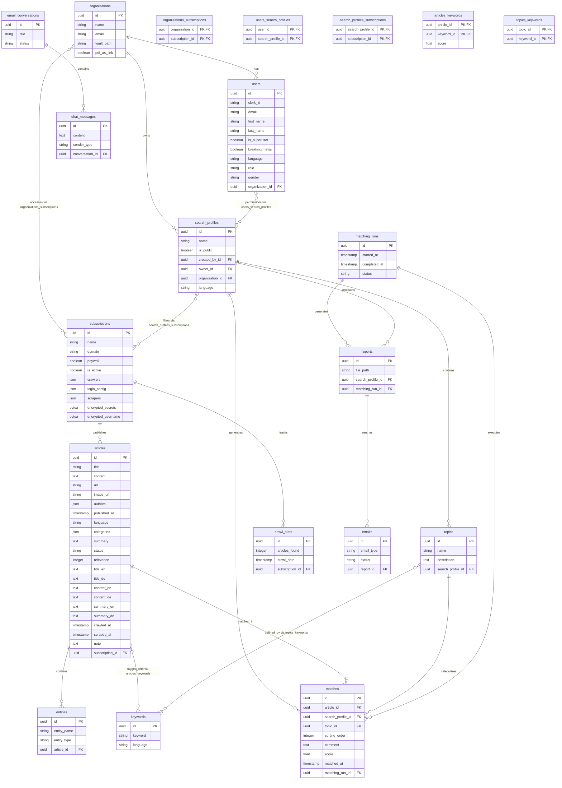

# Database Schema Documentation

## Overview

The MediaMind system uses a PostgreSQL database with 18+ tables supporting news article processing, user management, matching algorithms, and reporting functionality.

## Database Tables & File Locations

### Backend Tables (`apps/backend/app/models/`)

- **article.py** - News articles with multilingual support
- **user.py** - User management and authentication
- **organization.py** - Multi-tenant organization structure
- **search_profile.py** - Content filtering profiles
- **subscription.py** - News sources configuration
- **match.py** - Article-profile matching results
- **topic.py** - Thematic content groupings
- **keyword.py** - Search and matching keywords
- **entity.py** - Named entity extraction results
- **report.py** - Generated PDF reports
- **email.py** - Email delivery tracking
- **email_conversation.py** - Chatbot conversation threads
- **chat_message.py** - Individual chat interactions
- **matching_run.py** - Algorithm execution tracking
- **crawl_stats.py** - Web crawling performance metrics
- **auth.py** - Authentication models and utilities
- **breaking_news.py** - Breaking news notifications
- **associations.py** - Many-to-many relationship tables

## Database Schema Diagram

## Migration Files

- **Backend**: `apps/backend/alembic/versions/`
- **API**: `apps/api/alembic/versions/`
- **Configuration**: `alembic.ini` in respective app directories

## Technical Notes

- All tables use UUID primary keys
- Multilingual support (EN/DE) throughout the system
- Encrypted credentials for secure data handling
