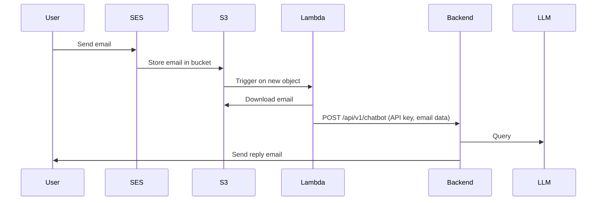

# MediaMind Chatbot Email Flow

## How it Works

1. **User sends an email**
   - The user sends an email to a designated address.

2. **Amazon SES receives and stores the email**
   - Amazon SES receives the email and stores the full message in an S3 bucket.
   - _Note: SES notifications do not include the full message body; the email must be retrieved from S3._

3. **S3 triggers an AWS Lambda function**
   - When a new email file is uploaded to S3, it triggers a Lambda function.

4. **Lambda function processes the email**
   - The Lambda function:
     - Downloads the email from S3.
     - Extracts the sender’s address, subject, and message body.
     - Sends a POST request to the `/api/v1/chatbot` endpoint, authenticated with an API key, containing the extracted email data.

5. **Backend receives and processes the request**
   - The backend receives the POST request.
   - It gets an existing or creates a new `EmailConversation` entry with the subject and user email.
   - The original user message is stored as a `ChatMessage` with role=USER.
   - The entire `EmailConversation` history is loaded, including the new user message, and passed to an LLM.
   - The LLM response is stored as a `ChatMessage` with role=ASSISTANT.

6. **Backend sends a reply email**
   - The backend sends a reply email to the original sender.

## Sequence Diagram

## AWS Setup Guide

To enable this flow, follow these steps to configure AWS resources:

### 1. **Set Up Amazon SES**

- **Verify your domain or email address** in SES.
- **Create a receipt rule** to handle incoming emails:
  - Go to **_SES_** > **_Configuration_** > **_Email receiving_** > _Receipt rule sets_.
  - Create a new rule:
    - Add a recipient (the email address you want to use).
    - Add an action: **_Deliver to Amazon S3 bucket_** (choose or create a bucket to store emails).
    - (Optional) Add an SNS notification action for debugging.
    - Finish and enable the rule set.

### 2. **Set Up the S3 Bucket**

- Create an S3 bucket (if not already done).
- Ensure SES has permission to write to the bucket (SES will create a policy automatically if you use the console).

### 3. **Create the Lambda Function**

- Create a new Lambda function (Python 3.x runtime).
- Upload your `trigger_chat.py` code (or use the inline editor).
- Set environment variables, especially `CHAT_API_KEY`.
- Add the necessary IAM permissions:
  - **_s3:GetObject_** for the S3 bucket.
  - (Optional) **_logs:CreateLogGroup_**, **_logs:CreateLogStream_**, **_logs:PutLogEvents_** for CloudWatch logging.

### 4. **Configure S3 Event Notification**

- In the S3 bucket, go to **_Properties_** > **_Event notifications_**.
- Add a new event notification:
  - Event type: **_All object create events_** (or filter for the SES prefix).
  - Destination: **_Lambda function_** (select your Lambda).
- Save the notification.

### 5. **(Optional) Test the Setup**

- Send a test email to your SES-verified address.
- Check S3 for the stored email.
- Check Lambda logs in CloudWatch for processing.
- Confirm the backend receives the POST request.

### 6. **Backend Configuration**

- Ensure the `/api/v1/chatbot` endpoint is deployed and accessible.
- The API key used by Lambda must match the backend configuration.

## Database Tables

### 1. EmailConversation

**Purpose**: Groups related emails and chat messages together as conversation threads.

**Essential Fields**:

- `id` (UUID, primary key)
- `subject` (string, email subject)
- `user_email` (string, indexed for quick lookup)
- `created_at` and `updated_at` (timestamps)

**Relationships**:

- One-to-many with ChatMessage

### 2. ChatMessage

**Purpose**: Stores individual messages within a conversation (both user and AI responses).

**Essential Fields**:

- `id` (UUID, primary key)
- `email_conversation_id` (UUID, foreign key)
- `role` (enum: USER or ASSISTANT)
- `content` (text, message content)
- `created_at` (timestamp)

**Relationships**:

- Many-to-one with EmailConversation
