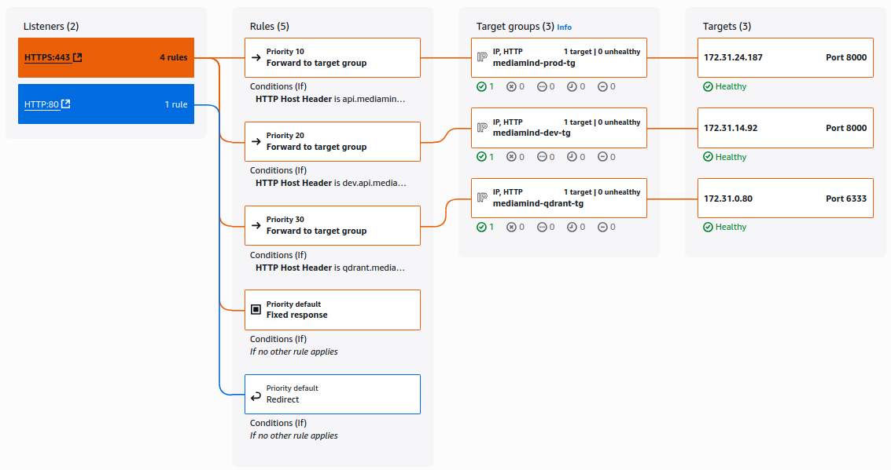
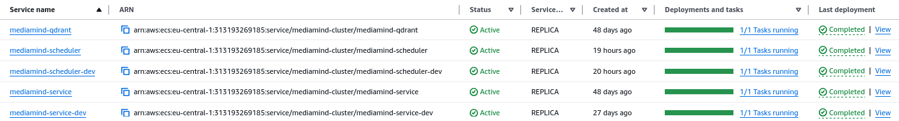
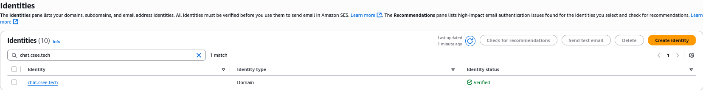
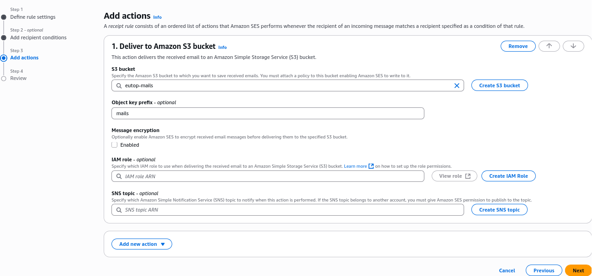
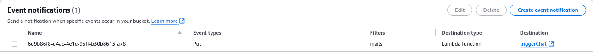
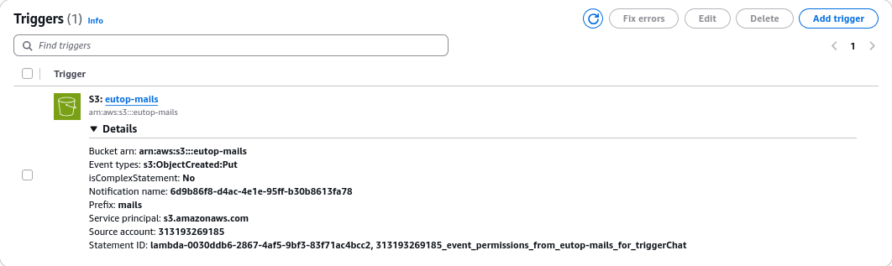
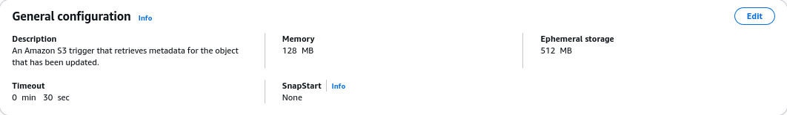

# Infrastructure Documentation

This document provides an overview of the infrastructure components used in the Mediamind project.

## Deployment

Since we use terraform to manage our infrastructure, the deployment process is as follows:

1. **Initialize Terraform**: Run `terraform init` to initialize the Terraform configuration.
2. **Plan the Deployment**: Run `terraform plan` to see the changes that will be applied.
3. **Apply the Changes**: Run `terraform apply` to apply the changes to the infrastructure.

Steps 1-3 are automated in the CI/CD pipeline, so you don't need to run them manually.

Only the [SES configuration](#ses) and the [Lambda function](#lambda) need to be created manually, as they are not managed by Terraform.

If you want to use a different custom domain for the Mediamind application, you need to set up the domain, its certificate in ACM and update the ALB listener rules in the terraform files accordingly. The domain should point to the ALB, and you need to ensure that the SSL certificate is correctly configured for HTTPS traffic.

## ALB

We use an Application Load Balancer (ALB) to route traffic to our ECS services. The ALB is configured with the following rules:

## ECR

We use Amazon Elastic Container Registry (ECR) to store our Docker images. The following repositories are currently in use:

- `mediamind`: This repository contains the main application Docker images.
- `mediamind-scheduler`: This repository contains the Docker images for the scheduling service.

Images are built and pushed to ECR as part of the CI/CD pipeline.

## ECS

We use Amazon Elastic Container Service (ECS) to run our Docker containers. The following services are deployed:

### mediamind-service and mediamind-service-dev

These services run the main application. The `mediamind-service` is the production version, while `mediamind-service-dev` is used for development and testing. They can be reached via the following URLs:

- Production: `https://api.mediamind.csee.tech`
- Development: `https://dev.api.mediamind.csee.tech`

To simplify local development and testing, the following proxy routes are available via [mediamind.csee.tech](https://mediamind.csee.tech):

- `/api/*` → `api.mediamind.csee.tech/api/*`
- `/dev/api/*` → `dev.api.mediamind.csee.tech/api/*`

**Example:**  
A request to [mediamind.csee.tech/dev/api/v1/healthcheck](https://mediamind.csee.tech/dev/api/v1/healthcheck) is proxied to [dev.api.mediamind.csee.tech/api/v1/healthcheck](https://dev.api.mediamind.csee.tech/api/v1/healthcheck)

### mediamind-scheduler and mediamind-scheduler-dev

These services run the scheduling component of the application. Similar to the main service, `mediamind-scheduler` is for production, and `mediamind-scheduler-dev` is for development and testing.

### mediamind-qdrant

This service runs the Qdrant vector database, which is used for storing and querying vector embeddings. It can be accessed at `https://qdrant.mediamind.csee.tech`.

## SES

We use Amazon Simple Email Service (SES) for sending the reports and chatbot messages via email. The SES configuration is as follows:

- **Email Sending Limits**: The SES service is configured to allow sending up to 50,000 emails per day with a maximum of 14 emails per second.

- **Verified Email Addresses**: The following email addresses are verified for sending emails:

  - `test@chat.csee.tech`

    

- **Receipt Rules**: When configuring SES, you need to create a receipt rule set to specify how incoming emails are handled:

- **Rule Set Name**: `mediamind-receipt-rule-set`
- **Rules**:

  - **Rule Name**: `mediamind-receipt-rule`
  - **Recipients**: `test@chat.csee.tech`
  - **Actions**: **Deliver to Amazon S3 bucket**

    

- **S3 Event Notification Configuration**:  
  To trigger the Lambda function only once per incoming email, ensure that only the `Put` event (`s3:ObjectCreated:Put`) is selected in the S3 event notification configuration for the bucket.  
  Do **not** select `All object create events` or `Multipart upload completed`, as this can result in multiple Lambda invocations for the same email.  
  The Lambda function should use Redis (with a `rediss://` URL) to cache processed S3 object keys for deduplication and avoid double-handling.  
  This is more efficient than using S3 object tags and avoids extra S3 API calls.  
  Make sure the Lambda execution role includes permissions for Redis access.

  

## Lambda

We use AWS Lambda for the chatbot functionality. The Lambda function is triggered by incoming emails to the SES service and processes the emails to generate responses. You can find the Lambda function code in the [/scripts](/scripts/lambda/) together with its AWS SAM template.

**Lambda Details:**

- Set a minimum timeout of 30 seconds for the Lambda function to ensure it has enough time to process incoming emails and generate responses.

  

- Increase the Lambda timeout in the AWS Console if you see timeouts.
- The Lambda function uses Redis to cache processed S3 object keys for deduplication.
- The Redis key is set after successful processing, with a TTL (e.g., 24 hours).
- If the Lambda encounters an error (e.g., API failure), it can optionally set a Redis key with a different value to avoid repeated retries.

## Database (PostgreSQL)

We use Amazon RDS for PostgreSQL to store application data. Credentials are managed via AWS Secrets Manager.

## Secrets Manager

Sensitive configuration (database credentials, API keys) is stored in AWS Secrets Manager and injected into ECS tasks at runtime. If you want to update the secrets, you can do so via the AWS Console or CLI, by updating `secrets.json` and runnign the `aws secretsmanager update-secret` command. More information can be found in the [AWS Secrets Manager documentation](https://docs.aws.amazon.com/secretsmanager/latest/userguide/manage_update.html) and [/infra/README.md](/infra/README.md).

## S3

The S3 bucket `eutop-mediamind` is used for storing the reports and incoming emails (via SES).

## VPC & Networking

All resources are deployed in a dedicated VPC with public and private subnets. Security groups restrict access to only necessary ports and services.

## Certificates

Multiple ACM certificates are attached to the ALB to support different domains (production, dev, Qdrant) via SNI.
