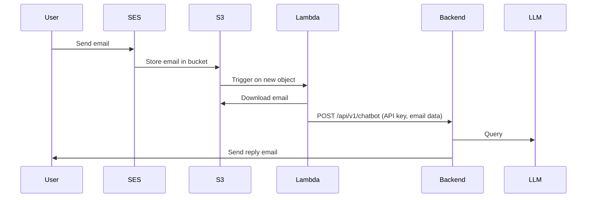

# MediaMind Chatbot Email Flow

## How it Works

1. **User sends an email**

   - The user sends an email to a designated address.

2. **Amazon SES receives and stores the email**

   - Amazon SES receives the email and stores the full message in an S3 bucket.
   - _Note: SES notifications do not include the full message body; the email must be retrieved from S3._

3. **S3 triggers an AWS Lambda function**

   - When a new email file is uploaded to S3, it triggers a Lambda function.

4. **Lambda function processes the email**

   - The Lambda function:
     - Downloads the email from S3.
     - Extracts the sender’s address, subject, and message body.
     - Sends a POST request to the `/api/v1/chatbot` endpoint, authenticated with an API key, containing the extracted email data.

5. **Backend receives and processes the request**

   - The backend receives the POST request, queries an LLM, and generates a reply.

6. **Backend sends a reply email**
   - The backend sends a reply email to the original sender.

## AWS Setup Guide

To enable this flow, follow these steps to configure AWS resources:

### 1. **Set Up Amazon SES**

- **Verify your domain or email address** in SES.
- **Create a receipt rule** to handle incoming emails:
  - Go to SES > Email Receiving > Rule Sets.
  - Create a new rule:
    - Add a recipient (the email address you want to use).
    - Add an action: **S3** (choose or create a bucket to store emails).
    - (Optional) Add an SNS notification action for debugging.
    - Finish and enable the rule set.

### 2. **Set Up the S3 Bucket**

- Create an S3 bucket (if not already done).
- Ensure SES has permission to write to the bucket (SES will create a policy automatically if you use the console).
- (Optional) Enable versioning or lifecycle rules as needed.

### 3. **Create the Lambda Function**

- Create a new Lambda function (Python 3.x runtime).
- Upload your `trigger_chat.py` code (or use the inline editor).
- Set environment variables, especially `CHAT_API_KEY`.
- Add the necessary IAM permissions:
  - **s3:GetObject** for the S3 bucket.
  - (Optional) **logs:CreateLogGroup**, **logs:CreateLogStream**, **logs:PutLogEvents** for CloudWatch logging.

### 4. **Configure S3 Event Notification**

- In the S3 bucket, go to **Properties > Event notifications**.
- Add a new event notification:
  - Event type: **All object create events** (or filter for the SES prefix).
  - Destination: **Lambda function** (select your Lambda).
- Save the notification.

### 5. **(Optional) Test the Setup**

- Send a test email to your SES-verified address.
- Check S3 for the stored email.
- Check Lambda logs in CloudWatch for processing.
- Confirm the backend receives the POST request.

### 6. **Backend Configuration**

- Ensure the `/api/v1/chats` endpoint is deployed and accessible.
- The API key used by Lambda must match the backend configuration.

## Sequence Diagram

## Security

The /api/v1/chats endpoint is protected by an API key to ensure only authorized Lambda functions can trigger chatbot conversations.
For more details, see the code in `trigger_chat.py` and the backend `/api/v1/chatbot` implementation.
