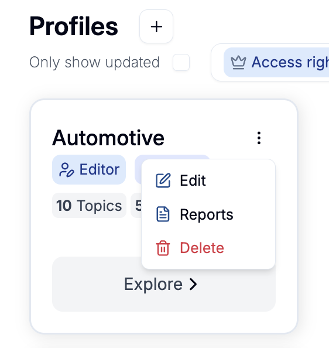
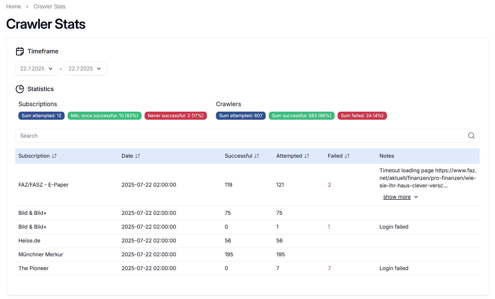
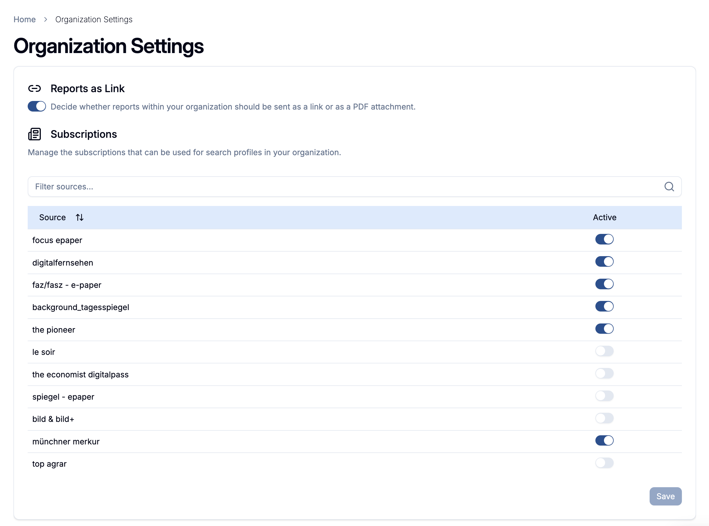

# MediaMind User Guide

MediaMind is an AI-based news analysis tool, which allows users & organisations to select their interests and receive auto-generated reports via email based on their preference (semantic not syntactic search).

This guide will introduce the most important concepts, as well as a rough overview of the features available to the user.

## General

### Terminology

#### Search Profile

A search profile is a specification of topics and keywords that define the user’s areas of interest. Based on this specification, MediaMind delivers daily reports containing relevant articles.

#### Topics & Keywords

Each search profile consists of one or more topics, and each topic contains multiple keywords. MediaMind uses these keywords to match news articles based on their meaning and context, not just exact word matches.

#### Subscriptions

MediaMind crawls articles from different news paper domains. You will only receive full texts for domains where your organisation has a valid subscription, although MediaMind might have more subscriptions than you have. (see Organisation Settings)

If you do not have a valid subscription, you will still receive summaries of articles from these domains, provided they match your search profile. However, access to the full article content will not be available.

> Note: Subscriptions are chosen on two different layers: The organization layer and the search profile layer. Organization layer subscriptions are you used for sending full text articles to internal emails (specified in search profile) & display them in the frontend. Search profile layer subscriptions are used for sending full text articles to external emails (specified in search profile).

#### Organisations

To use MediaMind, users must first create an account and be assigned to an organization. If you would like to join the platform, please contact a MediaMind administrator to be added to an existing organization or to have a new one created for you.
(see Admin Settings)

### Authorization Concept

#### User Roles

| Role       | Description                                                                                                                                                                                                                                                                                                          |
| ---------- | -------------------------------------------------------------------------------------------------------------------------------------------------------------------------------------------------------------------------------------------------------------------------------------------------------------------- |
| Admin      | Application admins of MediaMind. The can create organisations and assign users to organisations. They can create Subscriptions (with username & password) which MediaMind uses to crawl articles. Additionally they can see and edit all search profiles in MediaMind                                                |
| Maintainer | A maintainer is the admin of an organisation, so to speak. The can select organisation preferences (see Organisation Settings) and can edit & see all search profiles of their organisation. Additionally, they can change the owner of a search profile, which can otherwise only be done by the owners themselves. |
| Member     | Normal user within MediaMind which is assigned to an organisation. They can create profiles, edit them, add read/write access for other members & transfer ownership of their own search profiles.                                                                                                                   |

#### Search Profile Access

| Access | Description                                                                                                                                                          |
| ------ | -------------------------------------------------------------------------------------------------------------------------------------------------------------------- |
| Owner  | Each profile has exactly one owner. The owner can view and edit the profile as well as transfer ownership to another user. Users with the roles Maintainer or Admin can also do everything an owner can. |
| Write  | Can do the same as the owner, except transfering ownership.                                                                                                   |
| Read   | They can only see the profile, meaning see which topics are chosen and read the matched articles together with the topics & keywords which caused the match.         |

## Webapp Features

The webapp's main purpose is to administrate the preferences of users, organisations, and search profiles.
Additionally, matched results are also served to the user and can be browsed within the application.
Everything sent by email is also accessible through the webapp, except chatbot conversations.
The following views are available:

### Dashboard

The dashboard serves as the main entry point into the MediaMind web application. The dashboard contains an overview of all search profiles which the user has access to. The individual search profile cards serve as an entry into the [Search Profile Overview](#search-profile-overview) through the "Explore" button. They also display the users access rights to the profile as well as the visibility of the profile. 

#### Edit / Create Search Profiles

The profile cards provide shortcuts for deleting and editing the respective profile or accessing the [Report Download Center](#download-center). Profile creating is also handled through the dashboard via the "Plus" icon next to the "Profile" header.

### Search Profile Overview

This view contains a filter menu and a listing of all articles that were matched with your Search Profile. Each Article has an overall relevance score based on all topics of your profile and an additional matching score for each single topic. With the search bar you can also directly semantically search the Vector Database for similar articles to your input. Results are, per default, sorted by their overall relevance.

### Article Page

The article page features an integrated in-app reader for articles that match a selected search profile. In addition to the article content, the page presents a quantitative correlation between the topics and keywords of the search profile and those relevant to the specific article. Identified entities such as people and industries are also displayed. Furthermore, metadata including the publication date and original language is provided. The article page is accessed by clicking on the corresponding article in the [Search Profile Overview](#search-profile-overview).

Users can access the original article by clicking the “Original” button located at the top right of the page.

If an article comes from a source that requires a subscription for full access, but the user's organization does not hold a valid subscription for that source, an alert is displayed. In such cases, only a summary of the article is available.

### Personal Settings

The personal settings can be found by clicking on the user icon on the top right of the header, then "Manage Account" and "Personal Settings". You can choose personal preferences here regarding your language, gender and breaking news notifications.

### Breaking News

The Breaking News view is accessible via the entry at the top of the [Dashboard](#dashboard) page. This section displays significant global events that are currently receiving widespread attention.

### Download Center

The daily reports generated for each [Search Profile](#search-profile) are accessible long term through the download center of that search profile. The download center of a search profile can be accessed either via the "Reports" button displayed on the top right of the [Search Profile Page](#search-profile-overview) or through the [Quick Options](#edit--create-search-profiles) menu of a profile card.

### Admin Settings

This page is only accessable for MediaMind admin. You can create and edit Organizations here and add users with roles to them. You can also create and edit Subscriptions there. The attribute paywalled enables or disables the username and password for a subscription. For safety reasons you don't get your password shown here. If you want to set a new password, you can still do that by just typing it in and confirm.

### Crawler Stats

This page is only accessible to MediaMind administrators. It provides an overview of the crawling status, grouped by domain. This allows you to identify unsuccessful crawls and determine where further investigation may be needed.

### Organisation Settings

This page is only accessible to organisation maintainers.
There are two kinds of preferences which should be maintained on an organisation level.

You can decide via a true/false toggle, whether you want to receive the daily report as pdf directly via email or as a signed link (which is valid for a week and can be regenerated in the webapps Download Center) to the pdf.

The second option allows you to specify for which sources your organization holds a valid subscription. The full article content will be included in internal emails and in the webapp for the selected sources.

> Legal notice: Although it is possible to select subscriptions even if your organisation does not have a valid subscription/account for this domain, this is legally forbidden.
> Only select domains, where your organisation has a valid subscription!

## ChatBot Feature

The MediaMind Email Chatbot lets you get quick answers by replying to emails you receive from MediaMind.

**How to use:**

1. Reply directly to any email you received from MediaMind (such as your daily news report).
2. Write your question or request in the reply (e.g., "Can you summarize today’s report?" or "Can I get this in another language?").
3. Wait for a response. You will receive an answer by email, usually within a few minutes.

**Important:**
Only replies to existing MediaMind emails are supported.
New emails sent to the chatbot address will not be processed.
This limitation is mainly due to security concerns, but also about performance:
If you allow users to send emails to the Chatbot asking about a report containing a specific news article, the Chatbot would need to go through countless articles to find it, which would potentially lead to a large increase in costs.
To limit this, users can only directly respond to email threads, which are linked to the attached report.
If you send a new email (not a reply), you will receive a message asking you to reply to a previous MediaMind email instead.