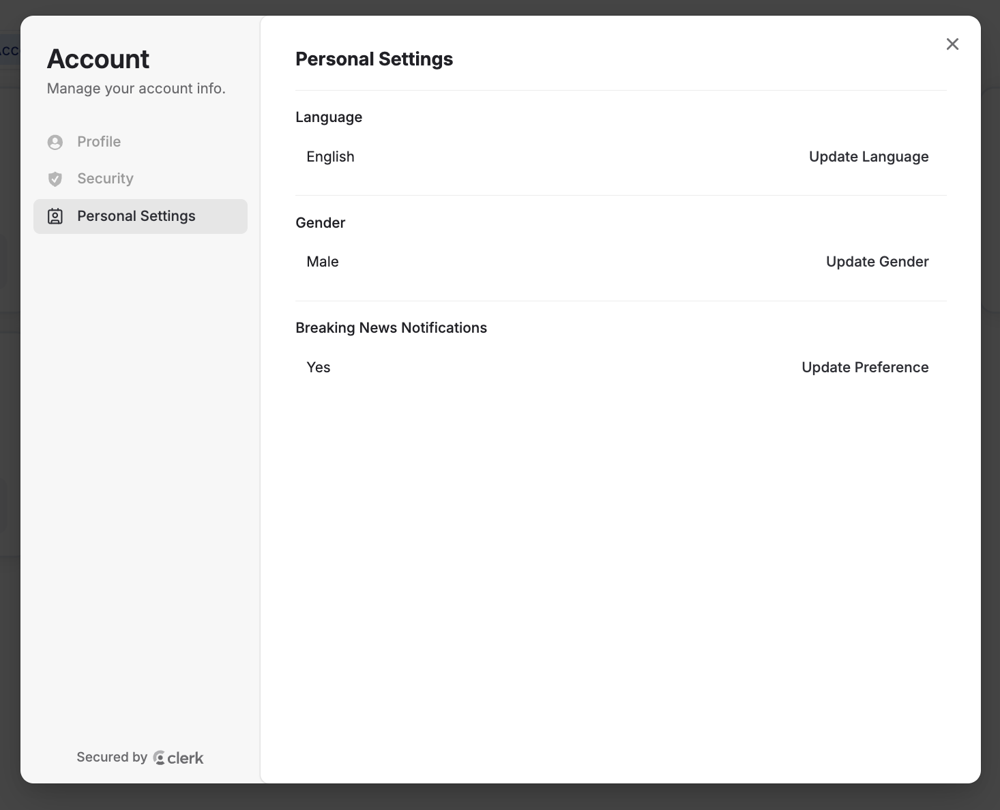

# MediaMind User Guide

MediaMind is an AI-based news analysis tool, which allows users & organisations to select their interests and receive auto-generated reports via email based on their preference (semantic not syntactic search).

This guide will introduce the most important concepts, as well as a rough overview of the features available to the user.

## General

### Terminology

#### Search Profile

A search profile is a specification of topics and keywords by the user, to receive daily reports about articles, which have been published and are matched to the interests of this search profile.

#### Topics & Keywords

A topic consists of multiple keywords. For your search profile you can create multiple topics with multiple keywords. MediaMind will semantically match articles to your profile based on the topcis defined by the keywords.

#### Subscriptions

Sometimes also called Domain. MediaMind crawls articles from different news paper domains. Legally, you are only allowed to receive full texts for domains where your organisation has a valid subscription, although MediaMind might have more subscriptions than you have. (see Organisation Settings)

If you dont have a valid subscription, you will still receive summaries for articles from these domains, if they are matched to your search profile.

> Note: For a search profile you can again select Subscriptions. These will then be used for external mail addresses from this search profile. (See search profile edit)

#### Organisations

An organisation is required to use MediaMind. If you want to use MediaMind for your organisation, contact a MediaMind admin, to create an organisation for you.

If new users should be added to your organisation, they have to first create an account and then, have to be added by a MediaMind admin to your organisation, before they can use the application.
(see Admin Settings)

### Authorization Concept

#### User Roles

| Role       | Description                                                                                                                                                                                                                                                                                                          |
| ---------- | -------------------------------------------------------------------------------------------------------------------------------------------------------------------------------------------------------------------------------------------------------------------------------------------------------------------- |
| Admin      | Application admins of Mediamind. The can create organisations and assign users to organisations. They can create Subscriptions (with username & password) which MediaMind uses to crawl articles. Additionally they can see and edit all search profiles in Mediamind                                                |
| Maintainer | A maintainer is the admin of an organisation, so to speak. The can select organisation preferences (see Organisation Settings) and can edit & see all search profiles of their organisation. Additionally, they can change the owner of a search profile, which can otherwise only be done by the owners themselves. |
| Member     | Normal user within MediaMind which is assigned to an organisation. They can create profiles, edit them, add read/write access for other members & transfer ownership of their own search profiles.                                                                                                                   |

#### Search Profile Access

| Access | Description                                                                                                                                                          |
| ------ | -------------------------------------------------------------------------------------------------------------------------------------------------------------------- |
| Owner  | Owner of the profile (only one possible). The owner can read/edit the profile and transfer ownership to another member (maintainer & admin are treated like owners). |
| Write  | Same rights as the owner without the option to transfer ownership.                                                                                                   |
| Read   | They can only see the profile, meaning see which topics are chosen and read the matched articles together with the topics & keywords which caused the match.         |

## Webapp Features

The webapps main purpose is to administrate the preferences of users, organisations & search-profiles.
But additional also results are served to the user and can be looked through. The folllwing views are available.

### Dashboard

### Edit / Create Search Profiles

### Search Profile Overview

### Article Page

### Personal Settings

The personal settings can be found by clicking on the user on the top right of the header, then "Manage Account" and "Personal Settings". You can choose personal preferences here regarding your language, gender and breaking news notifications.

### Breaking News

### Download Center

### Admin Settings

### Crawler Stats

This page is only accessable for MediaMind admins. You can get an overview of the status of the crawling grouped by domains. Thus, you see, whether crawling was not successfull or where you should have another look.

### Organisation Settings

This page is only accessable for organisation maintainers.
There are two kinds of preferences which should be maintained on an organisation level.

You can decide via a true/false toggle, whether you want to receive the daily report as pdf directly via email or as a signed link (which is valid for a week and can be regenerated in the webapps Download Center) to the pdf.

The second option is, that you need to select from which subscriptions/domains the full text will be sent to your organisations internal emails.

> Legal notice: Although it is possible to select subscriptions even if your organisation does not have a valid subscription/account for this domain, this is legally forbidden.
> Only select domains, where your organisation has a valid subscription!

## ChatBot Feature
